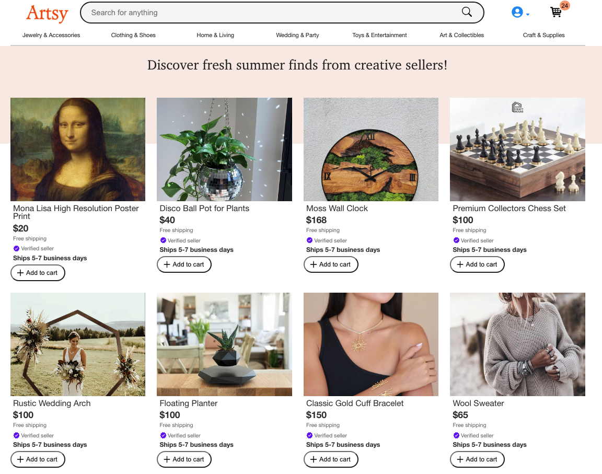
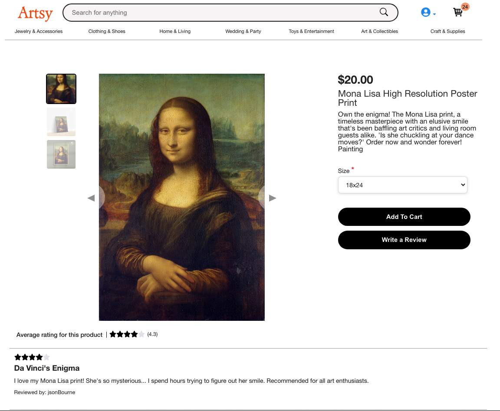
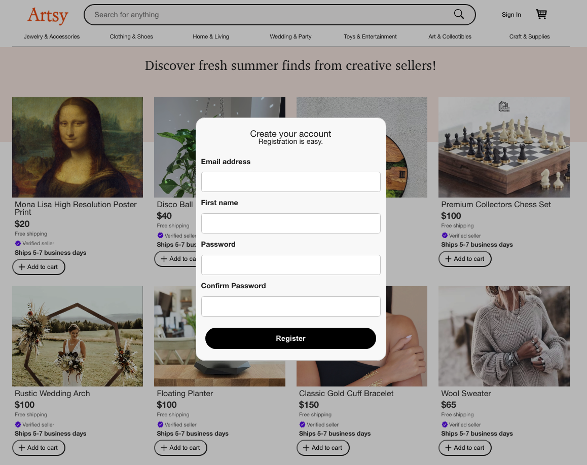
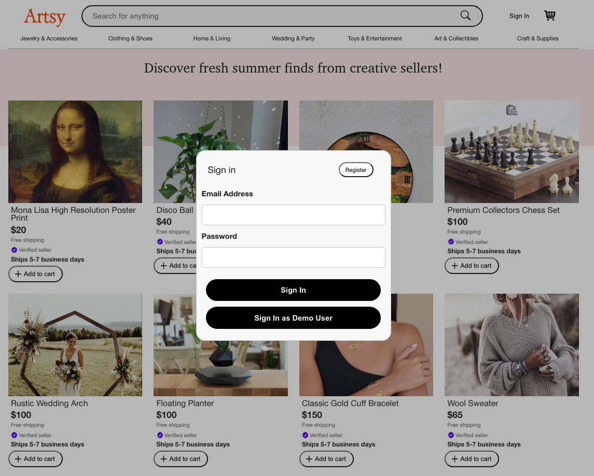
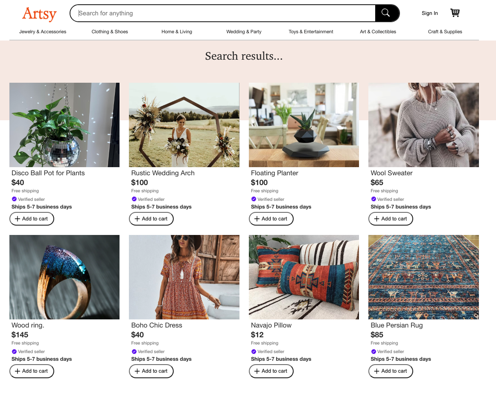
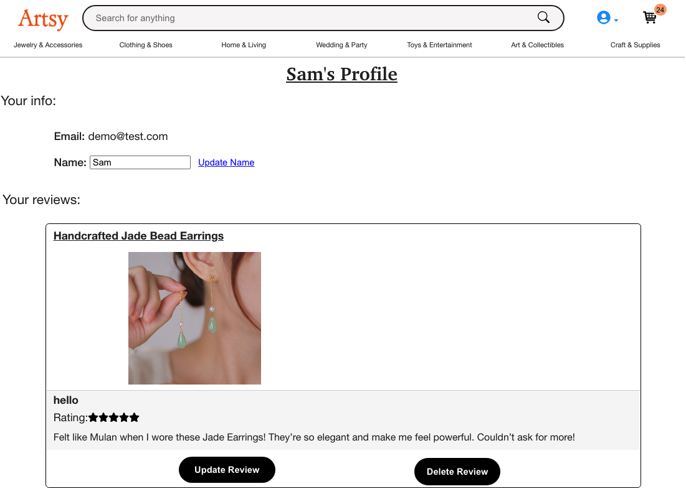
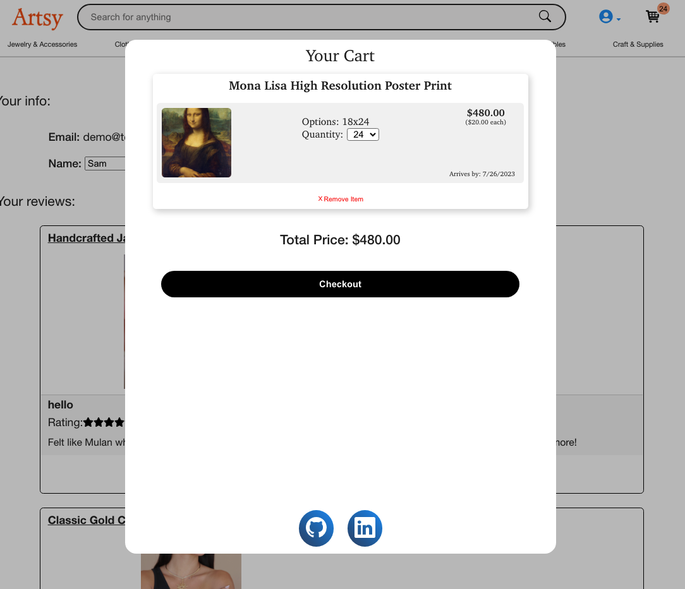
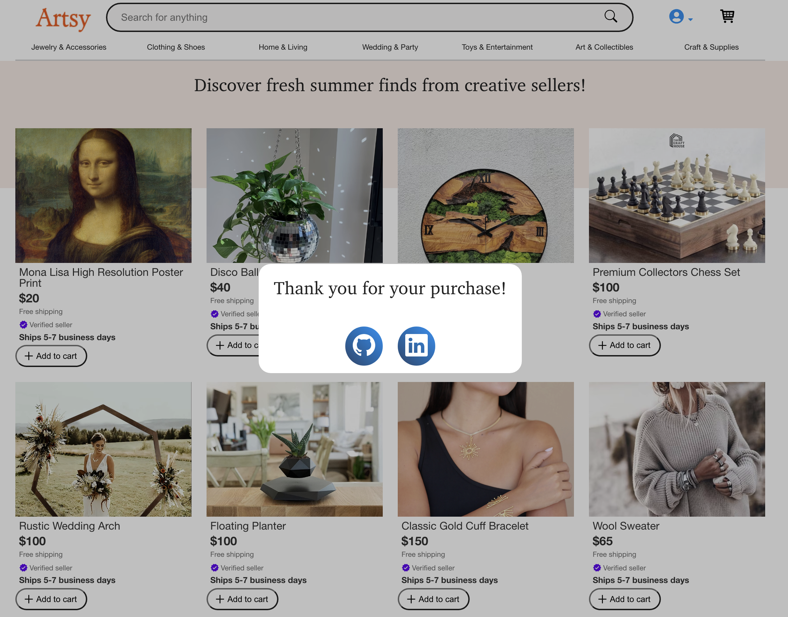

## [Live Link](https://artsy-bp61.onrender.com/)

## Introduction
Artsy is a full stack Etsy clone build on Ruby on Rails and React.

## Features
- **Users:**
    - Users can create accounts with firstname, email and password.
    - Option to login as demo user.
    - Full error handling and validation for signup and login.
- **Products:**
    - Seeded products of various categories featuring images (via AWS), reviews and size options.
    - Product Show page features and image carousel, reviews and average rating.
    - Products are searchable and able to be browsed by category.
- **Reviews:**
    - Reviews can be created, read, updated and deleted by user.
    - Only logged in users can leave reviews, and only update or delete their own reviews.
    - Modal confirmation message before a review is delete
- **Cart:**
    - Logged in users can add products to their Cart.
    - Cart is full CRUD feature.
    - Cart is visible as a modal, with a checkout button that clears the cart and renders a thank you message
    - Cart Button, visible on the navbar has cart item quanitity that updates when items are added to cart.

## Technologies Used
Here is a list of technologies used within this project:

- **Front End:**
  - React.js
  - Redux
  - CSS

- **Back End:**
  - Ruby on Rails
  - Node.js
  - Express.js
  - PostgreSQL

- **Deployment and Hosting:**
  - Render

## Future Plans
  - Add taxes and shipping fees cart
  - Have a sale options for products and a separate sale category
  - Add a "Helpful Review" option for all reviews (essentially a review like count)
  - Upload user image for userProfile

## Screenshots

### Splash

### Product Show

### Register Form

### Sign in Form

### Search Index

### User Profile

### Cart

### Checkout

